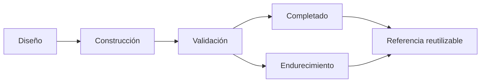

# Microsoft Fabric Projects Training

> Catálogo vivo y gobernado de laboratorios y patrones reutilizables de ingeniería de datos, analítica, gobierno e inteligencia artificial en Microsoft Fabric.

[](https://learn.microsoft.com/fabric/)
[](#estándar-de-gobierno)
[](#catálogo-de-proyectos)

## Propósito

`main` es la fuente de referencia del portafolio: registra qué proyectos existen, su nivel de madurez, responsables técnicos y controles mínimos. Los artefactos ejecutables viven aislados en las ramas `project/*`; ningún proyecto se considera publicable si su ficha de catálogo y su README específico no están actualizados.

## Catálogo de proyectos

| Proyecto | Rama | Estado | Dominio / resultado | Madurez | Acceso |
|---|---|---|---|---|---|
| Wind Turbine Power Analysis | `project/wind_turbine_power_analysis` | Completado | Analítica de generación eólica con Lakehouse Medallion y Power BI. | Laboratorio validado | [Abrir proyecto](../../tree/project/wind_turbine_power_analysis) |
| Smart Device Analytics | `project/SmartDeviceAnaliticsWS` | En endurecimiento | Analítica de catálogo y características de dispositivos inteligentes, con orquestación, Warehouse y reporte. | Referencia técnica | [Abrir proyecto](../../tree/project/SmartDeviceAnaliticsWS) |

### Lectura de estados

| Estado | Significado |
|---|---|
| Diseño | Alcance y arquitectura definidos; no listo para uso. |
| En construcción | Artefactos en desarrollo; no hay evidencia completa de ejecución. |
| En validación | Flujo desplegado y bajo pruebas funcionales, de calidad y operación. |
| Completado | Laboratorio reproducible con documentación y evidencia mínima. |
| En endurecimiento | Funcional, pero requiere cerrar controles de seguridad, portabilidad o gobierno antes de usarse como referencia empresarial. |

## Estándar de gobierno

Cada proyecto debe cumplir estos controles para figurar en el catálogo como una referencia reutilizable:

| Control | Mínimo exigible |
|---|---|
| Documentación | README con objetivo, arquitectura, inventario, prerrequisitos, despliegue y operación. |
| Seguridad | Sin secretos, tokens, contraseñas, rutas privadas ni identificadores de entorno en el repositorio. Las credenciales se gestionan externamente. |
| Portabilidad | Parámetros de workspace, Lakehouse, origen y destino separados de la lógica. |
| Calidad | Contrato de datos y reglas de calidad trazables para entidades críticas. |
| Operación | Orquestación identificada, manejo de errores, alertamiento y procedimiento de recuperación. |
| Trazabilidad | Decisiones relevantes, cambios de esquema y evidencia de validación versionados junto al proyecto. |
| Revisión | Cambios por Pull Request hacia `project/*`; actualizaciones del catálogo mediante Pull Request hacia `main`. |

## Ciclo de vida



Una actualización de un proyecto debe conservar su rama autocontenida y actualizar esta ficha cuando cambien el estado, alcance, riesgos, arquitectura o criterios de operación.

## Convención de ramas

```text
main                              # Catálogo, estándares y documentación transversal
project/<nombre-del-proyecto>     # Artefactos y documentación autocontenidos
feature/<proyecto>-<capacidad>    # Evolución puntual
fix/<proyecto>-<incidencia>       # Corrección puntual
```

## Cómo usar el repositorio

1. Selecciona un proyecto en el catálogo y revisa su README específico.
2. Clona la rama del proyecto que vayas a ejecutar.
3. Configura los parámetros de tu entorno de Fabric sin incorporar secretos al código.
4. Despliega, ejecuta las validaciones y documenta cualquier desviación o decisión.
5. Propón mejoras mediante Pull Request a la rama correspondiente.

```bash
git clone --branch project/SmartDeviceAnaliticsWS \
  https://github.com/oscargbocanegra/Fabric_MIcrosoft_Projects_Training.git
```

## Tecnologías

Microsoft Fabric · OneLake · Lakehouse · Warehouse · Notebooks Python · SQL · Data Pipelines · Dataflows Gen2 · Power BI · Modelos semánticos · Arquitectura Medallion · Data Quality · Automatización · IA Generativa

## Alcance

Repositorio de aprendizaje y referencia técnica. La adopción productiva requiere completar los controles de seguridad, gobierno, observabilidad y despliegue propios de cada organización.
