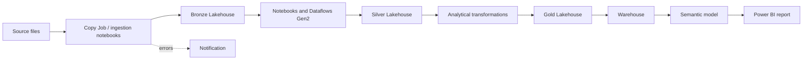

# Smart Device Analytics

> A Microsoft Fabric solution to ingest, standardize, and analyze a smart-device catalog and its technical characteristics.

[](https://learn.microsoft.com/fabric/)
[](#architecture)
[](#status-and-known-risks)

## Purpose

The project creates a reliable and queryable analytical chain for smart-device information: device, model, category, brand, camera, connectivity, operating system, screen, and physical specifications. It applies Bronze, Silver, and Gold layers and finishes with a Warehouse, semantic model, and summary report.

## Architecture



## Artifact inventory

| Layer / capability | Artifacts | Purpose |
|---|---:|---|
| Ingestion | 9 notebooks, 1 Copy Job | Loads device entities and technical attributes into Bronze. |
| Transformation | 6 notebooks, 4 Dataflows Gen2 | Standardizes and prepares entities for analytical consumption. |
| Utilities and operations | 2 base notebooks, 1 notification notebook | Provides configuration, shared functions, and error communication. |
| Orchestration | 5 Data Pipelines | Coordinates ingestion, transformation, full processing, analysis, and report refresh. |
| Storage | 3 Lakehouses | Separates Bronze, Silver, and Gold data according to the Medallion pattern. |
| Consumption | 1 Warehouse, 1 semantic model, 1 report | Supports querying and executive visualization. |

## Processing flow

1. `pl_ingest_smart_device` performs the initial load of source entities.
2. `pl_transformation_smart_device` runs transformations and Dataflows Gen2.
3. `pl_process_smart_device` composes the core processing workflow.
4. `pl_analize_smart_device` prepares the analytical layer and Warehouse.
5. `pl_report_smart_data` refreshes the semantic model and report.

Notebooks in the `includes`, `ingestion`, and `transformation` folders must preserve their input/output contracts and be invoked only through the approved pipelines for each stage.

## Prerequisites

- A Microsoft Fabric workspace with capacity for Lakehouse, Warehouse, Data Pipelines, Dataflows Gen2, and Power BI.
- Permission to create and execute the artifacts in this branch.
- Authorized smart-device source data.
- An enterprise secret-management and alerting mechanism before enabling notifications.

## Deployment and configuration

1. Create or select the target workspace.
2. Synchronize this branch through Git integration or import its artifacts into the workspace.
3. Assign the Bronze, Silver, and Gold Lakehouses and validate their connections.
4. Parameterize OneLake paths, connections, workspace names, and Lakehouse names for the target environment.
5. Configure notebook and Dataflow sources with managed external credentials.
6. Run ingestion, transformation, process, analysis, and report stages in that order; validate the output of each layer before continuing.

> Do not promote embedded workspace IDs, Lakehouse names, OneLake paths, or credentials between environments. Use deployment parameters, managed connections, and a secret store.

## Minimum data-quality controls

| Domain | Minimum validation |
|---|---|
| Identity | Device, model, and category keys are non-null and free of unjustified duplicates. |
| Referential integrity | Brand, model, category, and technical attributes have valid relationships. |
| Completeness | Required-field completion percentage is measured by entity and load. |
| Conformity | Types, units, accepted domains, and formats are normalized. |
| Freshness | The latest load timestamp and processed volume are recorded for each run. |

Validation evidence must accompany material changes before the project is declared reusable as a reference.

The operational contract is versioned in [`docs/data-contract.md`](docs/data-contract.md), and the rule catalogue is in [`docs/dq-rules.md`](docs/dq-rules.md).

## Business question and expected value

The lab demonstrates how a device catalog can become a reusable analytical product rather than a collection of source files.

| Business question | Analytical output | Value demonstrated |
|---|---|---|
| Which brands and categories dominate the catalog? | Brand/category dimensions and report visuals. | A consistent view for assortment and portfolio analysis. |
| How do technical capabilities vary across devices? | Camera, connectivity, operating-system, display, and physical-spec dimensions. | Comparable device attributes for product analysis. |
| Can the catalog be processed repeatedly without uncontrolled duplication? | `file_date` replay boundary, Warehouse procedures, and DQ rules. | A traceable and repeatable laboratory processing pattern. |
| Can consumers reach the result through a governed model? | Gold layer, Warehouse, semantic model, and Power BI report. | An end-to-end path from ingestion to decision support. |

### Demonstration metrics

These are repository-observed structural metrics; runtime volumes and business KPIs must be captured from a Fabric execution and labelled separately.

| Metric | Observed value | Evidence |
|---|---:|---|
| Source entities | 9 | Ingestion notebooks and data contract. |
| Notebooks | 18 | `notebooks/` plus the notification notebook. |
| Data Pipelines | 5 | `notebooks/pipeline/`. |
| Dataflows Gen2 | 4 | `dataflow_gen2/`. |
| Lakehouses | 3 | Bronze, Silver, and Gold artifact folders. |
| Report pages / visuals | 1 / 13 | `reports/report_quick_summary.Report/definition/`. |

See [`docs/value-demonstration.md`](docs/value-demonstration.md) for the evidence matrix, capture checklist, and lab acceptance criteria. The editable architecture diagram is [`docs/architecture.drawio`](docs/architecture.drawio).

## Operations

For a failure, identify the affected pipeline and activity, retain the execution identifier, and inspect the preceding layer before retrying. Do not rerun loads without confirming idempotency, duplicate handling, and the target-table state. Alerts must carry operational context only and no sensitive data.

Use the [deployment guide](docs/deployment-guide.md) for environment setup and the [operations runbook](docs/runbook.md) for execution, retry, recovery, escalation, RPO, and RTO targets. Material design choices are recorded in [`docs/adr/`](docs/adr/).

## Status and known risks

The project is functional as a lab and is currently in **hardening** before it can be recommended as an enterprise reference.

- Environment-dependent values (workspace, Lakehouse, OneLake paths, and connections) must be externalized.
- Error notification must use a secure mechanism; passwords and secrets are prohibited in notebooks, pipelines, and versioned configuration files.
- Data contracts, DQ rule identifiers, a runbook, deployment guidance, and initial ADRs are formalized under `docs/`; executable checks, evidence automation, environment parameterization, and CI validation remain hardening work.
- Historical naming is retained to avoid breaking existing references; corrections must be planned as a controlled migration.

## Governance and contribution

Changes are integrated through Pull Requests to `project/SmartDeviceAnaliticsWS`. Update this README whenever a change affects architecture, inventory, dependencies, security, data quality, or operations. Refer to the [governed catalog and common standards](../../blob/main/README.md) before contributing.

## Main structure

```text
copy job/                 # Copy Job-assisted ingestion
dataflow_gen2/            # Declarative transformations
email/                    # Notifications; no embedded secrets
lh_bronze.Lakehouse/      # Raw data
lh_silver.Lakehouse/      # Standardized data
lh_gold.Lakehouse/        # Analytical consumption data
notebooks/                # Utilities, ingestion, transformation, and pipelines
sm_smart_device_wh.../    # Semantic model
wh_smart_device.../       # Warehouse
reports/                  # Summary report
```
