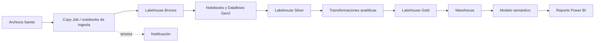

# Smart Device Analytics

> Solución de Microsoft Fabric para integrar, estandarizar y analizar el catálogo de dispositivos inteligentes y sus características técnicas.

[](https://learn.microsoft.com/fabric/)
[](#arquitectura)
[](#estado-y-riesgos-conocidos)

## Objetivo

El proyecto construye una cadena analítica para disponer información confiable y consultable de dispositivos inteligentes: dispositivo, modelo, categoría, marca, cámara, conectividad, sistema operativo, pantalla y especificaciones físicas. La solución aplica capas Bronze, Silver y Gold, culmina en un Warehouse, modelo semántico y reporte de resumen.

## Arquitectura



## Inventario de artefactos

| Capa / capacidad | Artefactos | Propósito |
|---|---:|---|
| Ingesta | 9 notebooks, 1 Copy Job | Carga de entidades de dispositivos y atributos técnicos hacia Bronze. |
| Transformación | 7 notebooks, 4 Dataflows Gen2 | Estandarización y preparación de entidades para consumo analítico. |
| Utilidades y operación | 2 notebooks base, 1 notebook de notificación | Configuración, funciones compartidas y comunicación de errores. |
| Orquestación | 5 Data Pipelines | Ingesta, transformación, proceso integral, análisis y actualización del reporte. |
| Almacenamiento | 3 Lakehouses | Separación Bronze, Silver y Gold conforme al patrón Medallion. |
| Consumo | 1 Warehouse, 1 modelo semántico, 1 reporte | Modelo de consulta y visualización ejecutiva. |

## Flujo funcional

1. `pl_ingest_smart_device` ejecuta la carga inicial de las entidades fuente.
2. `pl_transformation_smart_device` ejecuta las transformaciones y los Dataflows Gen2.
3. `pl_process_smart_device` compone el flujo de procesamiento.
4. `pl_analize_smart_device` prepara la capa analítica y el Warehouse.
5. `pl_report_smart_data` actualiza el modelo semántico y el reporte.

Los notebooks de las carpetas `includes`, `ingestion` y `transformation` deben conservar contratos de entrada/salida y ser invocados únicamente por los pipelines aprobados para cada etapa.

## Prerrequisitos

- Workspace de Microsoft Fabric con capacidad suficiente para Lakehouse, Warehouse, Data Pipelines, Dataflows Gen2 y Power BI.
- Permisos para crear y ejecutar los artefactos incluidos en esta rama.
- Fuentes de datos de dispositivos disponibles y autorizadas.
- Mecanismo corporativo de gestión de secretos y alertas antes de habilitar notificaciones.

## Despliegue y configuración

1. Crea o selecciona un workspace de destino.
2. Sincroniza los artefactos de esta rama mediante Git integration o impórtalos en el workspace.
3. Asigna los Lakehouses Bronze, Silver y Gold, y valida sus conexiones.
4. Parametriza rutas OneLake, conexiones y nombres de workspace para el ambiente de destino.
5. Configura las fuentes de los notebooks y Dataflows con credenciales externas gestionadas.
6. Ejecuta primero la ingesta, luego transformación, proceso, análisis y reporte; valida los resultados de cada capa antes de continuar.

> No promuevas rutas, IDs de workspace, nombres de Lakehouse ni credenciales de un ambiente a otro mediante código embebido. Usa parámetros de despliegue, conexiones administradas y un almacén de secretos.

## Controles de calidad mínimos

| Dominio | Validaciones mínimas |
|---|---|
| Identidad | Claves de dispositivo, modelo y categoría no nulas y sin duplicados no justificados. |
| Referencial | Marca, modelo, categoría y atributos técnicos con relaciones válidas. |
| Completitud | Porcentaje de valores obligatorios por entidad y por carga. |
| Conformidad | Tipos, unidades, dominios permitidos y formatos normalizados. |
| Frescura | Fecha/hora de la última carga y volumen procesado por ejecución. |

La evidencia de estas validaciones debe acompañar cada cambio relevante antes de declarar el proyecto como referencia reutilizable.

## Operación

Ante un fallo, identifica el pipeline y actividad afectados, conserva el identificador de ejecución y revisa la capa previa antes de reintentar. No reejecutes cargas sin confirmar idempotencia, duplicados y el estado de las tablas destino. Las alertas deben enviar únicamente contexto operativo no sensible.

## Estado y riesgos conocidos

El proyecto está funcional como laboratorio y se encuentra **en endurecimiento** antes de recomendarlo como patrón empresarial.

- Se deben externalizar los valores dependientes de entorno (workspace, Lakehouse, rutas OneLake y conexiones).
- La notificación de errores debe usar un mecanismo seguro; no se permiten contraseñas ni secretos en notebooks, pipelines o archivos de configuración.
- Se requiere formalizar contrato de datos, reglas DQ ejecutables, runbook, ADR y validación automática en CI.
- La nomenclatura histórica se conserva para no romper referencias existentes; las correcciones deben planearse mediante una migración controlada.

## Gobierno y contribución

Los cambios entran por Pull Request hacia `project/SmartDeviceAnaliticsWS`. Toda modificación debe actualizar este README cuando afecte arquitectura, inventario, dependencias, seguridad, calidad u operación. Consulta el [catálogo y estándar transversal](../../blob/main/README.md) antes de contribuir.

## Estructura principal

```text
copy job/                 # Ingesta asistida por Copy Job
dataflow_gen2/            # Transformaciones declarativas
email/                    # Manejo de notificaciones; sin secretos embebidos
lh_bronze.Lakehouse/      # Datos crudos
lh_silver.Lakehouse/      # Datos estandarizados
lh_gold.Lakehouse/        # Datos de consumo analítico
notebooks/                # Utilidades, ingesta, transformación y pipelines
sm_smart_device_wh.../    # Modelo semántico
wh_smart_device.../       # Warehouse
reports/                  # Reporte de resumen
```
