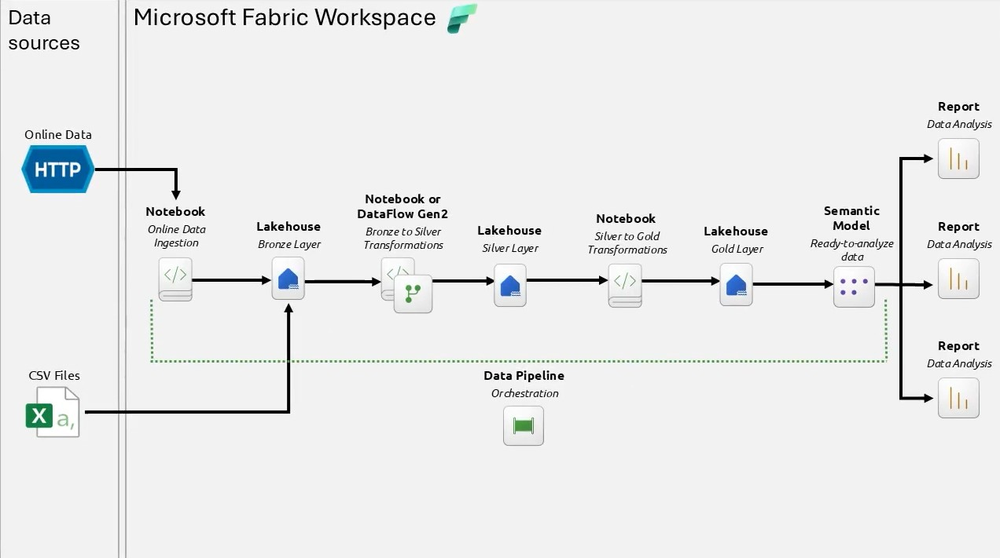
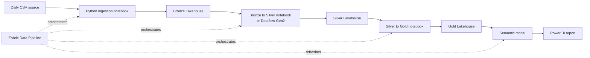
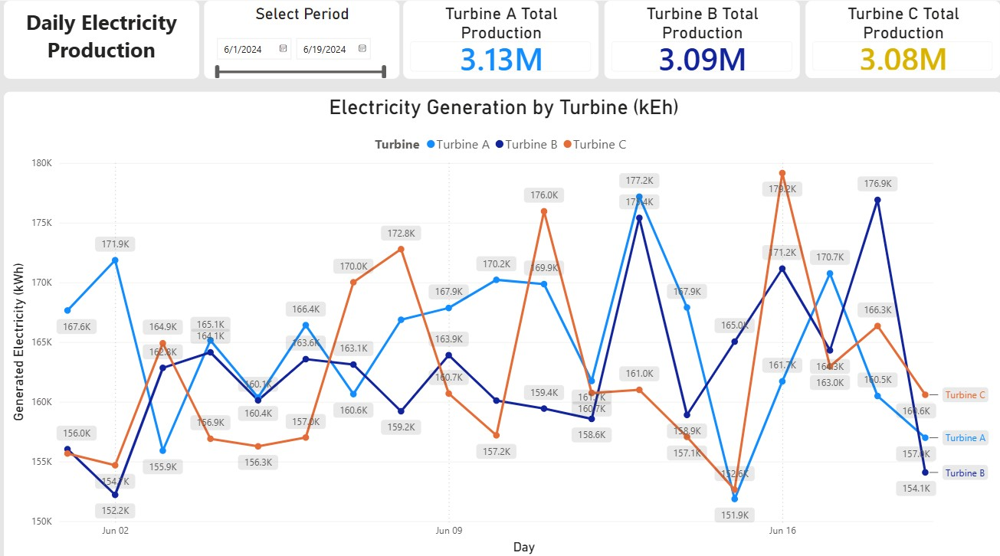

# Wind Turbine Power Analysis

> An end-to-end Microsoft Fabric analytics solution for daily wind turbine electricity-production analysis.

[](#project-outcome)
[](https://learn.microsoft.com/fabric/)
[](#architecture)

## Overview

This completed project implements a reproducible data pipeline for monitoring wind-turbine electricity generation. It ingests daily operational data, applies Bronze/Silver/Gold transformations, exposes an analytical star schema through a semantic model, and delivers an interactive Power BI report.

The solution demonstrates a complete Fabric delivery lifecycle: ingestion, transformation, orchestration, semantic modeling, reporting, refresh automation, and failure notification.

## Project Outcome

- Daily turbine-production data is incrementally loaded into the Bronze Lakehouse.
- Cleansed and enriched data is available in the Silver Lakehouse.
- A dimensional Gold layer supports analytical consumption.
- A Power BI semantic model and report provide production analysis by turbine and time period.
- A Fabric pipeline orchestrates the processing sequence, refreshes the semantic model, and sends an email alert when ingestion fails.

## Architecture



The architecture follows the Medallion pattern inside a Microsoft Fabric workspace:



## Data Flow

| Layer | Purpose | Main implementation |
|---|---|---|
| Source | Provides daily wind-power CSV files. | Remote CSV dataset |
| Bronze | Stores the raw operational data. | `lh_wind_power_bronze` |
| Silver | Cleans and enriches data with date and time attributes. | `NB_Bronze_To_Silver_Transformation` |
| Gold | Creates the analytical fact and dimension tables. | `NB_Silver_To_Gold_Transformations` and `lh_wind_power_gold` |
| Semantic | Defines relationships and business-ready measures. | `SM_wind_Turbine_power` |
| Consumption | Visualizes electricity production and turbine performance. | `RPT_Wind_Turbine_Power_analysis` |

## Processing Logic

### 1. Incremental daily ingestion

`NB_Get_Daily_Data_Python` reads the most recent date in the Bronze Delta table, calculates the next date, retrieves the corresponding daily CSV file, and appends it to the Bronze table.

### 2. Bronze to Silver transformation

`NB_Bronze_To_Silver_Transformation` standardizes numeric values, derives calendar fields, normalizes time values, and assigns a business-friendly time period: Morning, Afternoon, Evening, or Night.

An additional SQL notebook and a Dataflow Gen2 implementation are included under `Other/` for comparative learning.

### 3. Silver to Gold transformation

`NB_Silver_To_Gold_Transformations` generates the analytical model:

- `fact_wind_power`
- `dim_date`
- `dim_time`
- `dim_turbine`
- `dim_operational_status`

### 4. Orchestration and operational handling

`PL_orchestation` executes the notebooks in dependency order, refreshes the semantic model after the Gold load, and sends an email alert if the daily ingestion activity fails.

## Repository Assets

| Asset | Description |
|---|---|
| [`NB_Get_Daily_Data_Python.Notebook`](NB_Get_Daily_Data_Python.Notebook) | Incremental ingestion of the next daily dataset. |
| [`NB_Bronze_To_Silver_Transformation.Notebook`](NB_Bronze_To_Silver_Transformation.Notebook) | Data cleansing and enrichment. |
| [`NB_Silver_To_Gold_Transformations.Notebook`](NB_Silver_To_Gold_Transformations.Notebook) | Star-schema construction. |
| [`lh_wind_power_bronze.Lakehouse`](lh_wind_power_bronze.Lakehouse) | Raw-data Lakehouse definition. |
| [`lh_wind_power_silver.Lakehouse`](lh_wind_power_silver.Lakehouse) | Curated-data Lakehouse definition. |
| [`lh_wind_power_gold.Lakehouse`](lh_wind_power_gold.Lakehouse) | Analytical-data Lakehouse definition. |
| [`PL_orchestation.DataPipeline`](PL_orchestation.DataPipeline) | Fabric pipeline and execution dependencies. |
| [`SM_wind_Turbine_power.SemanticModel`](SM_wind_Turbine_power.SemanticModel) | Semantic model definition. |
| [`RPT_Wind_Turbine_Power_analysis.Report`](RPT_Wind_Turbine_Power_analysis.Report) | Power BI report definition. |
| [`Other/`](Other) | SQL notebook and Dataflow Gen2 alternatives. |

## Final Report

The final dashboard supports period selection and compares electricity generation across Turbines A, B, and C. It includes total-production indicators and a daily production trend for performance monitoring.



## How to Explore the Project

1. Clone this branch:

   ```bash
   git clone --branch project/wind_turbine_power_analysis \
     https://github.com/oscargbocanegra/Fabric_MIcrosoft_Projects_Training.git
   ```

2. Open the workspace items in Microsoft Fabric.
3. Review the pipeline dependency order and notebook transformations.
4. Refresh the semantic model and explore the Power BI report.

## Technology Stack

Microsoft Fabric · OneLake · Lakehouse · Delta tables · PySpark · Python · SQL · Data Pipelines · Dataflow Gen2 · Semantic Models · Power BI · Medallion Architecture

## Completion Status

**Completed.** The project delivers the planned end-to-end data and analytics workflow, from incremental ingestion through reporting.