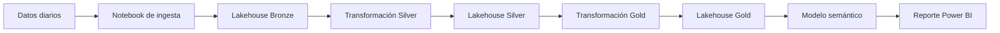

# Microsoft Fabric Projects Training

> Laboratorios prácticos de ingeniería de datos, analítica, gobierno e inteligencia artificial aplicada sobre Microsoft Fabric.

[](https://learn.microsoft.com/fabric/)
[](#principios-de-trabajo)
[](#proyectos)

## Propósito

Este repositorio reúne proyectos de entrenamiento y referencia para diseñar soluciones de datos modernas, reproducibles y orientadas a valor de negocio. Cada proyecto permite practicar un ciclo completo: desde la ingesta y transformación de datos hasta el modelo semántico, la visualización, los controles de calidad y, progresivamente, casos de uso de IA generativa.

El enfoque combina experiencia práctica en **Data Engineering**, arquitectura **Lakehouse**, gobierno de datos, automatización y analítica avanzada en el ecosistema Microsoft.

## Objetivos de aprendizaje

- Construir soluciones end-to-end con Microsoft Fabric y OneLake.
- Aplicar arquitectura Medallion: Bronze, Silver y Gold.
- Diseñar pipelines de ingesta y transformación con trazabilidad.
- Implementar modelos dimensionales y capas semánticas para Power BI.
- Incorporar controles de calidad, documentación y criterios de operación.
- Explorar automatización e IA aplicada a procesos y conocimiento de negocio.

## Principios de trabajo

| Principio | Aplicación en los proyectos |
|---|---|
| Reproducibilidad | Los artefactos de Fabric se almacenan como código y configuración versionable. |
| Arquitectura por capas | Separación clara entre datos crudos, datos estandarizados y datos de consumo. |
| Calidad y trazabilidad | Validaciones, contratos y evidencia operativa como parte del proceso de datos. |
| Gobierno desde el diseño | Naming, documentación, modelo semántico y seguridad considerados desde el inicio. |
| Valor de negocio | Cada laboratorio debe responder una pregunta analítica u operativa concreta. |
| Evolución pragmática | Se comienza con una solución funcional y se incrementa su madurez de forma controlada. |

## Proyectos

Cada proyecto vive en una rama independiente. `main` funciona como el punto de entrada, catálogo y guía de navegación del repositorio.

| Proyecto | Estado | Enfoque | Acceso |
|---|---|---|---|
| Wind Turbine Power Analysis | En progreso | Ingesta diaria, Lakehouse Medallion, modelo semántico y análisis de generación eólica. | [Abrir proyecto](../../tree/project/wind_turbine_power_analysis) |

## Proyecto destacado: Wind Turbine Power Analysis

Laboratorio de analítica energética que implementa un flujo de datos para analizar la potencia generada por turbinas eólicas y habilitar su consumo en Power BI.

**Capacidades implementadas**

- Ingesta diaria mediante notebook Python.
- Transformaciones Bronze → Silver y Silver → Gold.
- Lakehouses dedicados para las capas Bronze, Silver y Gold.
- Pipeline de orquestación.
- Modelo semántico con tablas de hechos y dimensiones de fecha, hora, turbina y estado operacional.
- Reporte Power BI para análisis de potencia e indicadores operativos.
- Alternativas de transformación con SQL y Dataflow para fines comparativos de aprendizaje.

**Arquitectura funcional**



Accede a todos los notebooks, Lakehouses, pipeline, modelo semántico y reporte en la rama [project/wind_turbine_power_analysis](../../tree/project/wind_turbine_power_analysis).

## Convención de ramas

```text
main                              # Índice, estándares y documentación común
project/<nombre-del-proyecto>     # Proyecto autocontenido
feature/<proyecto>-<capacidad>    # Evolución puntual de un proyecto
fix/<proyecto>-<incidencia>       # Corrección puntual
```

Los cambios de una capacidad se integran mediante Pull Request a su rama `project/...`. Los proyectos permanecen aislados de `main`, salvo que se actualice la documentación transversal o el índice.

## Cómo usar este repositorio

1. Consulta este `README` para identificar el laboratorio de interés.
2. Abre la rama del proyecto desde la tabla anterior.
3. Clona la rama específica para trabajar localmente:

   ```bash
   git clone --branch project/wind_turbine_power_analysis \
     https://github.com/oscargbocanegra/Fabric_MIcrosoft_Projects_Training.git
   ```

4. Sincroniza o despliega los artefactos en un workspace de Microsoft Fabric de laboratorio.
5. Documenta hallazgos, decisiones y validaciones junto al proyecto correspondiente.

## Roadmap

- [x] Definir el repositorio índice y el modelo de ramas independientes.
- [x] Publicar el laboratorio de análisis de potencia eólica.
- [ ] Estandarizar plantillas de documentación, calidad de datos y operación.
- [ ] Incorporar nuevos laboratorios de ingeniería de datos, gobierno, analítica e IA aplicada.
- [ ] Consolidar guías reutilizables para arquitectura Lakehouse y Data Hub.

## Tecnologías

Microsoft Fabric · OneLake · Lakehouse · Notebooks Python · SQL · Data Pipelines · Dataflows · Power BI · Modelos semánticos · Arquitectura Medallion · Data Quality · Automatización · IA Generativa

## Alcance

Este es un repositorio de aprendizaje y experimentación técnica. Los proyectos privilegian el entendimiento de patrones reutilizables, buenas prácticas de ingeniería y evidencia verificable antes de su adopción en entornos empresariales.

---

Si este repositorio te resulta útil, puedes marcarlo con una estrella para seguir su evolución.
